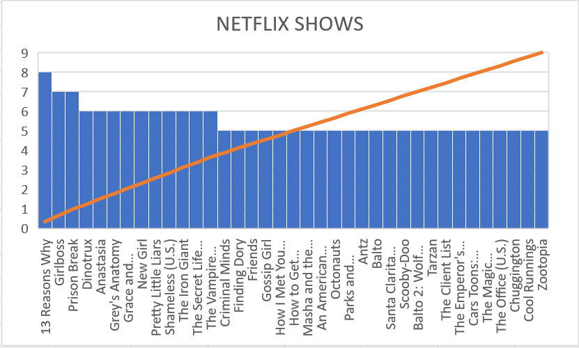

# map-reduce-yalamarthi

## About Data:
The data I used was different netflix shows which has five attributes namely Title,Rating,Rating year,Rating Description, and User rating size.

## Data Story:
I have analyzed the netflix shows data by comparing the Top 19 shows on netflix 

